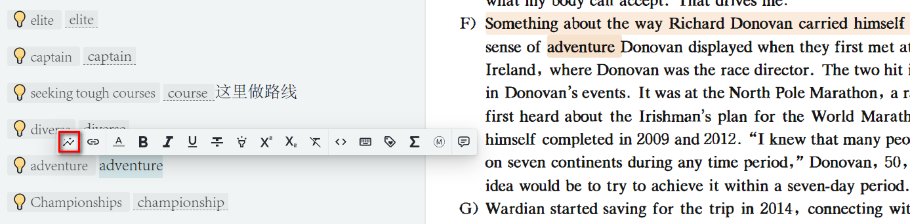
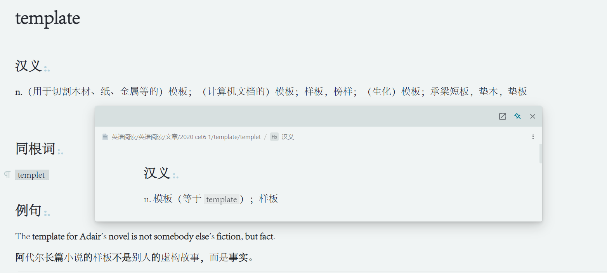
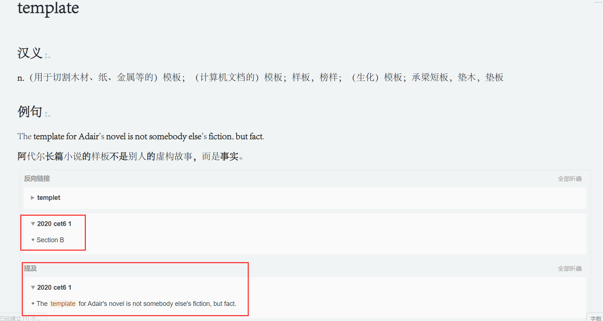
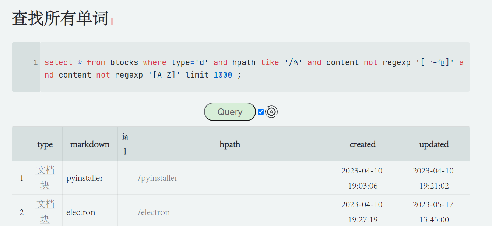
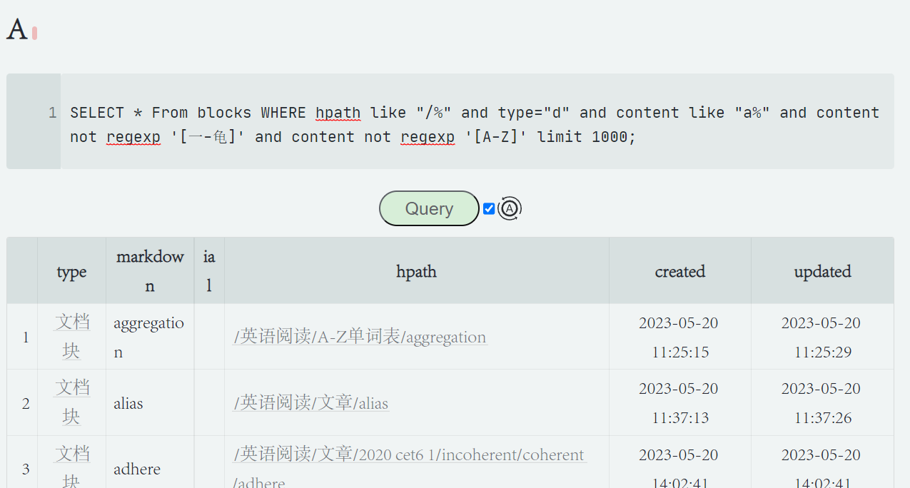
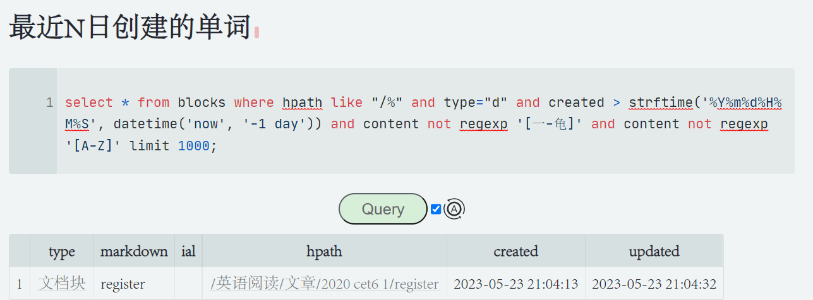

[English](https://github.com/nuistZPZ/siyuan-template-RememberEnglish/blob/master/README.md)

# 反向链接巧记单词

分享一套背单词时用的模板，用于记录背单词时联想的灵感，需要先下载挂件Note Backlink和Query。

 [langzhou/note-backlinks： 思源笔记挂件：类似 Roam Research，在文档页面内展示反向链接 (github.com)](https://github.com/langzhou/note-backlinks) 

 [Zuoqiu-Yingyi/widget-query： 一个将思源笔记数据库查询结果以表格样式渲染的挂件 |以表格样式呈现思源笔记数据库查询结果的小组件。 (github.com)](https://github.com/Zuoqiu-Yingyi/widget-query) 


## 使用场景

使用反向链接可以让我们在任何地方记单词，而不会繁乱找不到彼此的关系。

随手记下一个单词，使用快捷键[[]] 或者UI创建以该单词为标题的新页面。




## 示例

每个单词写在一个单独页面，用于记录该单词的所有信息。



使用双向链接，可以跳转到相关单词页面，也可以看到哪些单词与此相关。

以template为例，我在其他地方的句子引用了template，不需要我手动添加这个句子到template的例句中，我也能找到我以前使用过的template例句。



使用SQL查询已记录的单词，形成自己的专属单词本。提供查找全部单词、最近N天创建、最近N天更新、按照字母排序查找等模板。

### SQL参数解释

#### 通用参数

- **hpath 意思是 文件存放位置**

```
hpath like "/%"  在/后面添加文件夹名称
```

- **type 意思是 块的类型**

```
type = "d" 中的d代表文档块
```

- **content 意思是 块的内容**

```

```

#### 查找所有单词

使用limit 1000是因为，思源默认只返回64个。若你的单词库超过了1000，请替换成更大的数字。下同




#### 按照单词首字母查找

将content like "a%"的a替换为你想找的字母即可



#### 最近N日创建的单词

将-1 day的-1替换为你想要的日期即可，如最近三天请使用-3 day




## 致谢

感谢两个挂件的作者，感谢思源的作者。